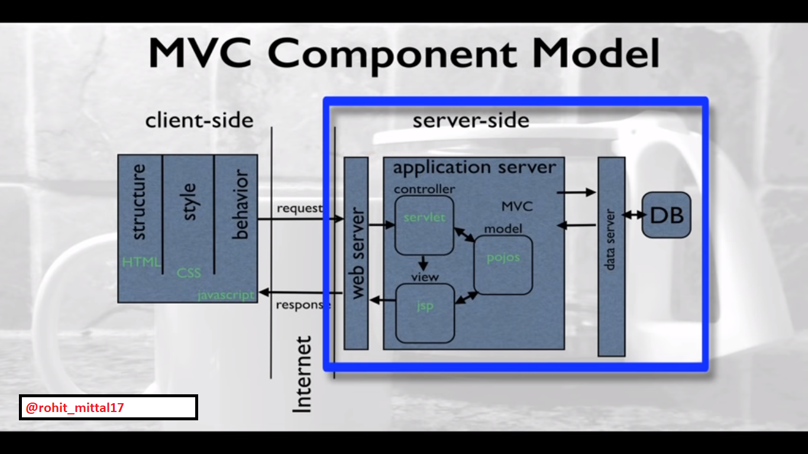

# JSP-Servlets
Basics of JSP and Servlets
 
Good To Learn while Learning JSP and Servlet:  
[1] JSTL   
[2] JNDI 
 
[Prerequisites : Core Java + HTML Forms + Basics of JDBC (For database connection)]

Serlvet Life Cycle:
 

 
Model View Controller (MVC) Architechture using JSP and Servlet:
 
 

